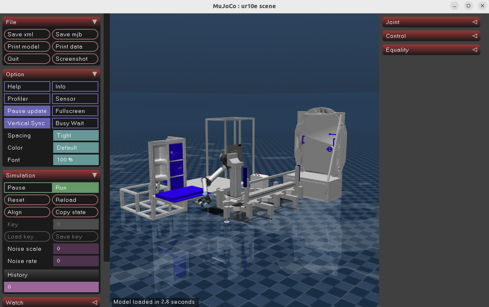

# CLR Demos

The packages in this folder contain demonstration applications using CLR.

## Overview

The examples here, as well as the simulation itself, have been used to trial sim-to-real pipelines for developing behaviors to run in iMETRO facilities.
These include behaviors requiring color/depth perception, force/torque sensors, or realistic dynamics of the robot in its environment.

They are intended to provide starting points of how to interact with CLR using commonly available open source tools:

* [Pick and Place with a CTB](./clr_pick_and_place_demo/README.md)
  * Uses MoveIt2 and basic perception capabilities to pick up a cargo transfer bag (CTB) and place it inside a bench storage container.
* [DRT Behavior Trees](./clr_behavior_pick_and_place_demo/README.md)
  * Behavior tree enabled planning framework for constructing more complex capabilities.
* [Planning with RoboPlan](./clr_roboplan_demos/README.md)
  * Demonstration the motion planning capabilities of RoboPlan using CLR.

